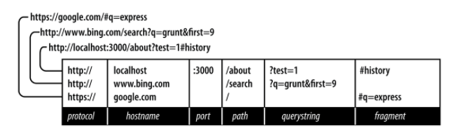

# Chapter 6. The Request and Response Objects

## URL을 이루는 부분들



### Protocol

- 어떤 방식으로 호출이 전송될지 정의
- http, https, file, ftp

### Host

- 사용중인 컴퓨터 (localhost)
- 로컬 네트워크 (단순한 단어)
- IP 주소
- top-level 도메인 (TLD) : .com 또는 .net
    - 일반적으로 www 같은 서브 도메인 (필수가 아님)
    
### Port

- 특수한 포트 번호 : 80 (HTTP), 443 (HTTPS)
- 위 포트를 사용하지 않는다면 1023 이상의 번호를 사용 ([well-known ports](http://en.wikipedia.org/wiki/List_of_TCP_and_UDP_port_numbers))
- 보통 기억하기 쉬운 3000, 8080, 8088 활용

### Path

- 앱이 어떤 동작을 할지 나타내는 첫 번째 파트
- 고유한 식별자를 사용

### Querystring

- 이름/값 쌍으로 이루어진 부가적인 집합들
- 물음표(?)로 시작되며, 각각의 쌍은 and 기호(&)로 구분
- 이름/값들은 URL 인코딩되어 있어야 한다. (`encodeURIComponent`)

### Fragment (또는 hash)

- 서버에 전달되지 않는 부분
- 싱글페이지 어플리케이션을 제어하는데 사용
- 본래 사용 목적은 앵커 태그로 마킹 된 문서의 특정 부분으로 이동하기 위함 (`<a id="chapter06">`)

## HTTP Request Methods

- 클라이언트가 서버와 통신하기 위한 호출 메서드(또는 HTTP verbs)들이 HTTP 프로토콜에 정의되어 있다.
- 대표적으로 GET, POST
- 삭제를 위한 API 호출하는 경우 DELETE도 사용
- Express에선 특정 메서드를 위한 핸들러를 자주 작성

## Request Headers

- 브라우저가 어떤 언어를 선호하는지, 어떤 환경에서 동작하는지 등 보이지 않게 전달되는 정보가 많다.
- request 객체의 `headers` 속성에 구성

[headers.js](/examples/headers.js)

```javascript
app.get('/headers', function (req, res) {
    res.set('Content-Type', 'text/plain');
    var s = '';
    for (var name in req.headers) {
        s += name + ': ' + req.headers[name] + '\n';
    }
    res.send(s);
});
```

## Response Headers

- 호출 헤더와 마찬가지로 메타데이터, 서버 정보 등을 보이지 않게 브라우저로 전달
- 앞서 보았던 `Content-Type`이나 사이트 최적화를 위한 캐시 주기 설정 같은 (챕터 16에서 다룸)
- 서버 구동 환경을 내려줄 수 있으나 해커에게 노출되면 좋을거 없기 때문에 제거

```javascript
app.disable('x-powered-by');
```

## Internet Media Types

- `Content-Type` 헤더는 매우 중요한 정보
- [Internet media type](http://www.iana.org/assignments/media-types/media-types.xhtml) 포맷이며 type, subtype, optional parameter 형태로 구성
- `text/html;charset=UTF-8`
- "content type", "MIME(Multipurpose Internet Mail Extensions) type"으로 불리기도

## Request Body

- GET 호출은 없지만, POST 호출엔 대부분 존재
- 일반적인 POST는 `application/x-www-form-urlencoded` 미디어 타입
    - 인코딩 된 이름/값 쌍이며 and 기호로 구분 
- 파일 업로드를 위해선 `multipart/form-data`
- AJAX 호출은 `application/json`

## Parameters

- "파라미터"란 용어는 여러가지 용도, 의미를 가지고 있어서 혼란
- Node 어플리케이션에서 request 객체의 `param` 메서드는 이런 파라미터들이 혼제되어서 사용을 피해주길
    - 쿼리스트링과 POST body 또는 세션에 파라미터가 동시에 들어오면 어떤 값이 우선시될까?
    - PHP가 이런 이유로 비난을 많이 받음

## The Request Object

- `http.IncomingMessage` Node 코어 객체 인스턴스가 시작 주기
- req, request
- Express가 몇몇 기능들 첨가

### req.params
*named route parameters* 배열을 포함 (챕터14에서 다룸)

### req.param(name)
named route paramter 또는 GET, POST 파라미터 반환. 이 메서드는 사용하지 않기를 권장

### req.query
쿼리스트링을 객체 형태로 가짐

### req.body
- POST 파라미터를 객체 형태로 가짐
- request body 부분이며 컨텐츠 타입에 따라 미들웨어에서 파싱 가능 (챕터10에서 다룸)
 
### req.route
현재 매칭된 라우터 정보. 주로 라우터 디버깅에 유용

### req.cookies / req.signedCookies
클라이언트에서 전달되는 쿠키 값들 (챕터9에서 다룸)

### req.headers
클라이언트에서 전달 받는 호출 헤더들
 
### req.accepts(\[types\])
- [타입 매칭에 편리한 메서드](http://expressjs.com/4x/api.html#req.accepts)
- types는 단일, 콤마구분 리스트, 배열 모두 가능
- 이 메서드는 공개 API들 작성할 때 주로 사용 - 브라우저는 항상 HTML을 기본으로 수락한다고 가정

### req.ip
클라이언트의 IP 주소

### req.path
호출 경로 (프로토콜, 호스트, 포트, 쿼리스트링 제외)

### req.host
- 클라이언트가 제출하는 호스트이름 간단히 가져온다.
- 스푸핑 될 수 있으므로 보안 목적으로 사용되어선 안된다.

### req.xhr
AJAX 호출이면 true 반환

### req.protocol
해당 호출에 사용된 프로토콜

### req.secure
`req.protocol === 'https'` 동일

### req.url / req.originalUrl
경로와 쿼리스트링만 반환해서 조금 부적합한 명칭. `req.url`은 내부적인 라우팅으로 재작성 될 수 있지만, 
`req.originalUrl`은 원래 호출값을 유지하고 있음

### req.acceptsLanguages
(오타 있음) req.accepts 메서드와 비슷하게 동작하고 `Accept-Language` 헤더를 매칭

## The Response Object

- `http.ServerResponse` Node 코어 객체 인스턴스가 시작 주기
- res, resp, response
- Express가 몇몇 기능들 첨가

### res.status(code)
- HTTP 상태 코드
- 200 (OK), 404 (Not Found), 500 (Server Error)
- 리다이렉트 (301, 302, 303, 307) 위해선 `redirect` 메서드 사용

### res.set(name, value)
응답 헤더 설정. 보통 직접 조작하는 경우는 없다.

### res.cookie(name, value \[, options\]), res.clearCookie(name \[, options\])
- 클라이언트에 저장될 쿠키를 설정하거나 제거 
- 미들웨어 지원이 필요하다. (챕터9에서 다룸)

### res.redirect(\[status,\] url)
- 기본 리다이렉트 코드는 302 (Found)
- 영구적으로 페이지 이동이 필요하면 301 (Moved Permanently)

### res.send(body), res.send(status, body)
- Express 기본 컨텐츠 타입은 `text/html`
- body가 객체 또는 배열이면 JSON 응답으로 대신 내려간다. (컨텐츠 타입도 적당하게 변경)
- 하지만 이런 경우 `res.json` 사용을 권장

### res.json(json), res.json(status, json)
클라이언트에 JSON 전달

### res.jsonp(json), res.jsonp(status, json)
- 클라이언트에 JSONP 전달 
- json과 다르게 [내부적으로 JSONP 콜백을 지원](http://expressjs.com/4x/api.html#res.jsonp)한다.

### res.type(type)
- `res.set('Content-Type', type)` 대신 간편 사용
- type에다가 컨텐츠 타입 축약 입력이 가능. 예를 들어, `res.type('txt')`

### res.format(object)
`Accept` 호출 헤더에 따라서 서로 다른 내용을 전달할 수 있다. (챕터15에서 다룸)
```javascript
res.format({
    'text/plain': 'hi there',
    'text/html': '<b>hi there</b>'
});
```

### res.attachment(\[filename\]), res.download(path \[, filename\] \[, callback\])
- 두 메서드 모두 응답 헤더에 `Content-Disposition: attachment` 설정
- filename은 브라우저에 힌트 (저장 다이얼로그에 노출)
- `res.download` 차이점은 저장 성공/실패 이후 동작 제어 여부

### res.sendFile(path \[, options\] \[, callback\])
- path로 지정된 특정 경로에 파일을 읽어 클라이언트에 전달하는 역할
- `static` 미들웨어 케이스에 쉽게 적용
- [예제 코드를 보면 이해가 쉬울지도](http://expressjs.com/4x/api.html#res.sendFile)

### res.links(links)
`Link` 응답 헤더를 설정. 아주 일부 케이스에서 사용된다.

```javascript
res.links({
    next: 'http://api.example.com/users?page=2',
    last: 'http://api.example.com/users?page=5'
});
```

헤더 결과는:

```
Link: <http://api.example.com/users?page=2>; rel="next",
      <http://api.example.com/users?page=5>; rel="last"
```

### res.locals, res.render(view \[, locals\] \[, callback\])
- res.locals는 뷰 렌더링을 위한 기본 컨텍스트 객체 (request/response 사이클에서만 의미있음)
- res.render는 설정된 템플릿 엔진으로 렌더링
    - res.locals는 locals에 의해 오버라이드
    - 기본 응답 코드는 200; 별도의 코드를 사용하고 싶다면 res.status 사용

## 더 많은 정보
- 일단 먼저 [Express API 문서][]를 체크
- 문서에 없는 추가적인 정보를 원한다면 [Express 소스][] 살펴보기
- 파고들다 보면 [Node 문서, 특히 HTTP 모듈](http://nodejs.org/api/http.html) 참조 필요

### [lib/application.js](https://github.com/strongloop/express/blob/master/lib/application.js)
- Express 메인 인터페이스
- 미들웨어가 어떻게 연결되는지, 뷰는 어떻게 렌더링되는지

### [lib/express.js](https://github.com/strongloop/express/blob/master/lib/express.js)
- *lib/application.js* 연결과 뼈대들 구성
- 여기서 반환하는 함수가 `http.createServer` 사용하여 실제 Express 앱을 실행하게 된다.

### [lib/request.js](https://github.com/strongloop/express/blob/master/lib/request.js)
- Node의 `http.IncomingMessage` 객체 확장
- request 객체의 모든 정보를 볼 수 있다.

### [lib/response.js](https://github.com/strongloop/express/blob/master/lib/response.js)
- Node의 `http.ServerResponse` 객체 확장
- response객체의 모든 정보를 볼 수 있다.

### [lib/router/route.js](https://github.com/strongloop/express/blob/master/lib/router/route.js)
- [기본 라우팅 기능](http://expressjs.com/4x/api.html#router.route) 제공
- 200 라인이 안되며, 매우 단순

## 요약하기

### 컨텐츠 렌더링

내용들을 렌더링하고 싶을 때 대부분 res.render 사용하게 될 것이다. 
가끔은 빨리 테스트를 작성하려고 res.send 사용해야만 할수도 있다.
기타 등등 케이스들을 예제 6-1 부터 6-8 까지 사례로 살펴보자.

#### 예제 6-1. 기본 사용법

```javascript
// basic usage
app.get('/about', function (req, res) {
    res.render('about');
});
```

#### 예제 6-2. 200 외의 응답 코드

```javascript
app.get('/error', function (req, res) {
    res.status(500);
    res.render('error');
});
// or on one line...
app.get('/error', function (req, res) {
    res.status(500).render('error');
});
```

#### 예제 6-3. 쿼리스트링, 쿠키, 세션 값들 포함하여 뷰에 컨텍스트 전달

```javascript
app.get('/greeting', function (req, res) {
    res.render('about', {
        message: 'welcome',
        style: req.query.style,
        userid: req.cookie.userid,
        username: req.session.username
    });
});
```

#### 예제 6-4. 레이아웃 없이 뷰 렌더링

```javascript
// 레이아웃 파일을 참조하지 않기 때문에
// views/no-layout.handlebars 내용엔 HTML 전체가 들어가야 한다.
app.get('/no-layout', function (req, res) {
    res.render('no-layout', {
        layout: null
    });
});
```

#### 예제 6-5. 커스텀 레이아웃으로 뷰 렌더링

```javascript
// 레이아웃 파일 views/layouts/custom.handlebars 사용한다.
app.get('/custom-layout', function (req, res) {
    res.render('custom-layout', {
        layout: 'custom'
    });
});
```

#### 예제 6-6. plaintext 출력 렌더링

```javascript
app.get('/test', function (req, res) {
    res.type('text/plain');
    res.send('this is a test');
});
```

#### 예제 6-7. 에러 핸들러 추가

```javascript
// 이 부분은 라우터들 제일 뒤에 위치해야 한다.
// "next" 함수 사용하지 않아도 Express에서 알아서 에러 핸들러로 인식한다.
app.use(function (err, req, res, next) {
    console.error(err.stack);
    res.status(500).render('error');
});
```

#### 예제 6-8. 404 핸들러 추가

```javascript
// 이 부분은 라우터들 제일 뒤에 위치해야 한다.
app.use(function (req, res) {
    res.status(404).render('not-found');
});
```

### 폼 프로세싱

폼 처리를 하고 싶을 때, 폼 정보는 보통 req.body (또는 가끔식 req.query) 사용하게 된다.
AJAX 호출 또는 브라우저 호출 (챕터8에서 다룸)을 다룰 땐 req.xhr 사용하면 된다.
6-9, 6-10 예제를 보자.

#### 예제 6-9. 폼 프로세싱 기본

```javascript
// body-parser 미들웨어가 연결되어 있어야 한다.
app.post('/process-contact', function (req, res) {
    console.log('Received contact from ' + req.body.name +
        ' <' + req.body.email + '>');
    // 데이터베이스에 저장하고....
    res.redirect(303, '/thank-you');
});
```

#### 예제 6-10. 개선된 폼 프로세싱
(오타 : res.xhr, res.render)

```javascript
// body-parser 미들웨어가 연결되어 있어야 한다.
app.post('/process-contact', function (req, res) {
    console.log('Received contact from ' + req.body.name +
        ' <' + req.body.email + '>');
    try {
        // 데이터베이스에 저장하고....

        return req.xhr ?
            res.json({success: true}) :
            res.redirect(303, '/thank-you');
    } catch (ex) {
        return req.xhr ?
            res.json({error: 'Database error.'}) :
            res.redirect(303, '/database-error');
    }
});
```

### API 제공하기

폼 프로세싱을 API로 제공할 때 인자를 req.query, req.body로 참조할 수 있다.
HTML 대신 JSON, XML, plaintext 어떻게 다른지 보고, 
그리고 잘 사용하지 않는 PUT, POST, DELETE 같은 HTTP 메서드를 제법 사용하게 될 것이다.

```javascript
var tours = [
    {id: 0, name: 'Hood River', price: 99.99},
    {id: 1, name: 'Oregon Coast', price: 149.95},
];
```

#### 예제 6-11. JSON만 반환하는 간단한 GET endpoint

```javascript
app.get('/api/tours', function (req, res) {
    res.json(tours);
});
```

#### 예제 6-12. JSON, XML, text 반환하는 GET endpoint
(오타 매우 많음)

```javascript
app.get('/api/tours', function (req, res) {
    var toursXml = '<?xml version="1.0"?><tours>' +
        tours.map(function (p) {
            return '<tour price="' + p.price +
                '" id="' + p.id + '">' + p.name + '</tour>';
        }).join('') + '</tours>';
    
    var toursText = tours.map(function (p) {
        return p.id + ': ' + p.name + ' (' + p.price + ')';
    }).join('\n');
    
    res.format({
        'application/json': function () {
            res.json(tours);
        },
        'application/xml': function () {
            res.type('application/xml');
            res.send(toursXml);
        },
        'text/xml': function () {
            res.type('text/xml');
            res.send(toursXml);
        },
        'text/plain': function () {
            res.type('text/plain');
            res.send(toursText);
        }
    });
});
```

#### 예제 6-13. 갱신을 위한 PUT endpoint
(로직이 이상함)

```javascript
app.put('/api/tour/:id', function (req, res) {
    var item = null,
        p = tours.some(function (o) {
            item = o;
            return o.id == req.params.id;
        });
    if (p) {
        if (req.query.name) item.name = req.query.name;
        if (req.query.price) item.price = req.query.price;
        res.json({
            success: true,
            item: item
        });
    } else {
        res.json({error: 'No such tour exists.'});
    }
});
```

#### 예제 6-14. 삭제를 위한 DEL endpoint
(app.del 메서드는 deprecated)

```javascript
app.delete('/api/tour/:id', function (req, res) {
    var i;
    for (i = tours.length - 1; i >= 0; i--) {
        if (tours[i].id == req.params.id) break;
    }
    if (i >= 0) {
        tours.splice(i, 1);
        res.json({
            success: true,
            tours: tours
        });
    } else {
        res.json({error: 'No such tour exists.'});
    }
});
```


[Express API 문서]: http://expressjs.com/4x/api.html
[Express 소스]: https://github.com/strongloop/express/tree/master
